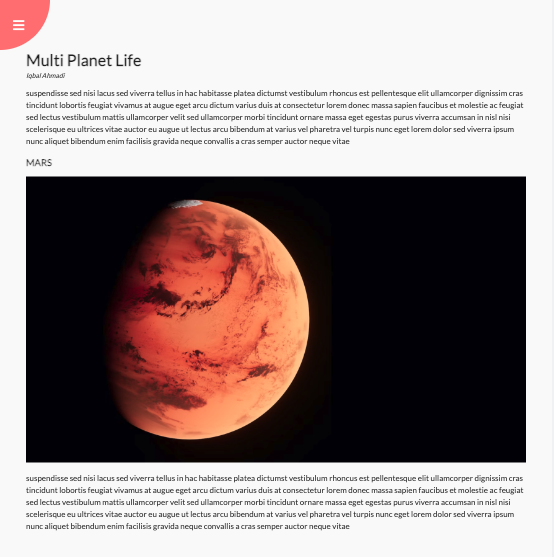
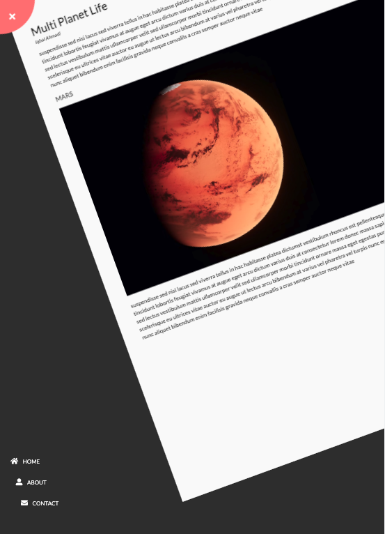

# Rotating Navigation

This project is a simple HTML, CSS, and JavaScript web page where users can click on the navigation, and the page rotates, and the navbar appears at the left bottom.

## Project Requirements

- Modern web browser with JavaScript support.

## Installation Instructions

1. Clone the repository to your local machine.
2. Open the index.html file in your browser.

## Usage Instructions

1. Click on the navigation button to rotate the page and show the navbar.
2. Use the navbar to navigate to different sections of the page. (This is section is not functioning at the moment)

## Features

- Rotating web page on click of the navigation button.
- Navbar appearing at the left bottom of the page.

## Limitations and Known Issues

- The project is not optimized for mobile devices.
- The rotation effect may not work correctly on some older web browsers.

## Conclusion

This project is a simple example of how to use HTML, CSS, and JavaScript to create a dynamic web page with rotating effects and a navbar. Feel free to customize it further to fit your needs.
